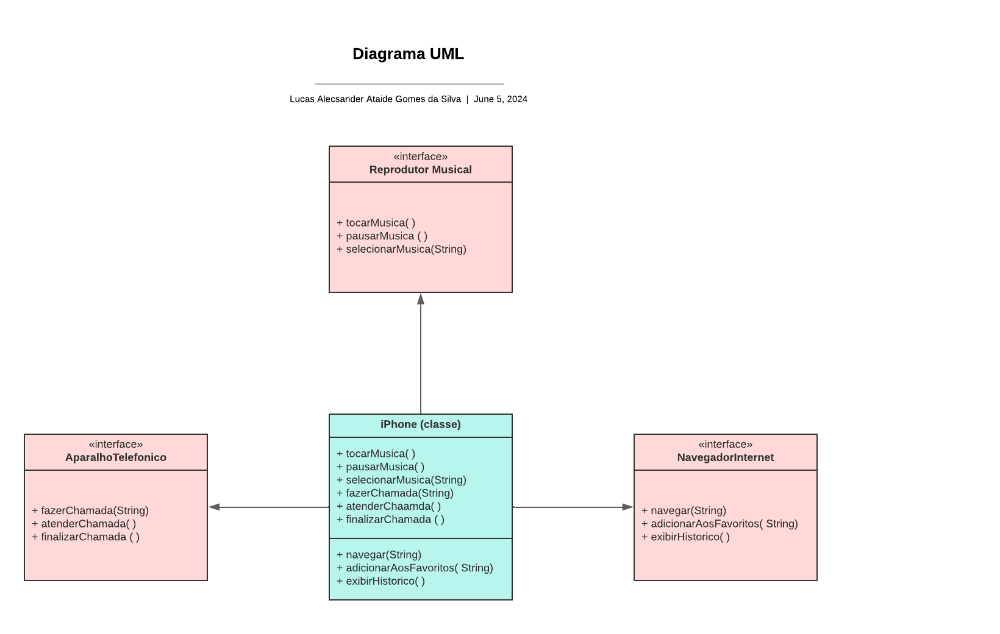

# Modelando o iPhone com UML

Este é um projeto simples que implementa classes e interfaces para simular funcionalidades de um iPhone, como reprodução de música, operações telefônicas e navegação na internet.

## Classes e Interfaces

### Aparelho Telefonico (Interface)

A interface `AparelhoTelefonico` define métodos relacionados a operações telefônicas.

- `fazerChamada(String numero)`: Faz uma chamada para o número especificado.
- `atenderChamada()`: Atende a chamada telefônica.
- `finalizarChamada()`: Finaliza a chamada telefônica.

### Navegador Internet (Interface)

A interface `NavegadorInternet` define métodos relacionados à navegação na internet.

- `navegar(String url)`: Navega para a URL especificada.
- `adicionarAosFavoritos(String url)`: Adiciona a URL aos favoritos do navegador.
- `exibirHistorico()`: Exibe o histórico de navegação do navegador.

### Reprodutor Musical (Interface)

A interface `ReprodutorMusical` define métodos relacionados à reprodução de música.

- `tocarMusica()`: Inicia a reprodução de música.
- `pausarMusica()`: Pausa a reprodução de música.
- `selecionarMusica(String musica)`: Seleciona a música especificada para reprodução.

### iPhone (Classe Abstrata)

A classe abstrata `iPhone` implementa as interfaces `ReprodutorMusical`, `AparelhoTelefonico` e `NavegadorInternet`.

- `tocarMusica()`, `pausarMusica()`, `selecionarMusica(String musica)`: Implementa funcionalidades relacionadas à reprodução de música.
- `fazerChamada(String numero)`, `atenderChamada()`, `finalizarChamada()`: Implementa funcionalidades relacionadas a operações telefônicas.
- `navegar(String url)`, `adicionarAosFavoritos(String url)`, `exibirHistorico()`: Implementa funcionalidades relacionadas à navegação na internet.

### Diagrama UML

